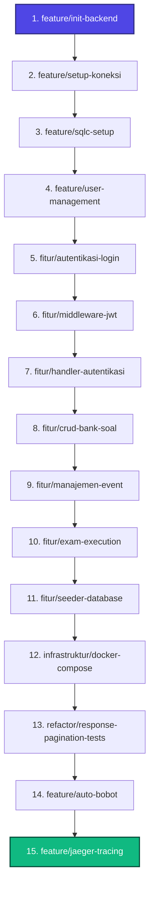

# 🗺️ Pramuka CAT - Sequence Branch & Roadmap Rewrite dari 0

Dokumen ini memuat **urutan branch (branch sequence) yang logis dan kronologis** untuk membangun kembali sistem **Pramuka CAT Backend** dari awal sampai akhir. Setiap tahapan dilengkapi dengan tujuan utama, cakupan file, serta instruksi eksekusi.

Dengan mengikuti urutan ini, Anda dapat merancang kembali arsitektur **Clean Architecture + DDD** dengan stabil dan terarah.

---

## 🗂️ Daftar Urutan Branch (Branch Sequence)



---

## 📖 Detail Langkah Setiap Branch

### 1. `feature/init-backend`
*   **Tujuan:** Menginisialisasi proyek Go baru dan membentuk struktur folder standard **Clean Architecture / Domain-Driven Design (DDD)**.
*   **Aktivitas:**
    *   Inisialisasi modul (`go mod init`).
    *   Membuat struktur folder utama:
        *   `backend/cmd/api/` (Entrypoint utama)
        *   `backend/internal/domain/` (Inti bisnis/Entity)
        *   `backend/internal/usecase/` (Aplikasi/Logika bisnis)
        *   `backend/internal/adapters/` (Infrastruktur/Adapter: database, handler, middleware)
        *   `backend/pkg/` (Library pembantu)
    *   Menyiapkan boilerplate untuk server HTTP (Echo framework).

### 2. `feature/setup-koneksi`
*   **Tujuan:** Konfigurasi aplikasi secara dinamis berbasis `.env` dan inisialisasi koneksi database.
*   **Aktivitas:**
    *   Membuat mekanisme load environment variable (menggunakan `spf13/viper` atau `joho/godotenv`).
    *   Menulis file koneksi PostgreSQL (`pkg/database/postgres.go`) menggunakan Driver `jackc/pgx`.
    *   Menulis file koneksi Redis (`pkg/cache/redis.go`) menggunakan Driver `go-redis`.
    *   Menambahkan file konfigurasi `.env` dan `.env.example`.

### 3. `feature/sqlc-setup`
*   **Tujuan:** Mengintegrasikan **sqlc** sebagai generator database layer type-safe tanpa menulis boilerplate ORM secara manual.
*   **Aktivitas:**
    *   Membuat file `sqlc.yaml` untuk konfigurasi generator.
    *   Membuat folder `backend/db/migrations` untuk menyimpan script DDL PostgreSQL (`golang-migrate`).
    *   Menulis file SQL Query (`backend/db/queries/`) untuk fungsi CRUD dasar.
    *   Menjalankan perintah `sqlc generate` untuk menghasilkan model-model database Go otomatis di `backend/internal/adapters/repository/sqlc/`.

### 4. `feature/user-management`
*   **Tujuan:** Membangun core domain pertama, yaitu pengelolaan data User.
*   **Aktivitas:**
    *   Mendefinisikan struct User di `internal/domain/user.go`.
    *   Membuat interface `UserRepository` dan `UserUsecase`.
    *   Mengimplementasikan repository database user (`internal/adapters/repository/`) yang memanggil kode hasil generasi `sqlc`.
    *   Mengimplementasikan usecase logika bisnis user (pembuatan password aman via bcrypt, validasi input).

### 5. `fitur/autentikasi-login`
*   **Tujuan:** Membangun fungsi logika otentikasi di level Domain & Usecase.
*   **Aktivitas:**
    *   Membuat service hashing password (`pkg/hash/bcrypt.go`).
    *   Membuat service token JWT generator dan validator (`pkg/token/jwt.go`).
    *   Mengimplementasikan `AuthUsecase` untuk login, refresh token, dan pencatatan sesi (session management) menggunakan Redis untuk penyimpanan token blacklist / session token.

### 6. `fitur/middleware-jwt`
*   **Tujuan:** Membatasi akses endpoint API menggunakan sistem token.
*   **Aktivitas:**
    *   Membuat custom Echo middleware (`internal/adapters/middleware/jwt_middleware.go`).
    *   Mengekstrak klaim JWT (User ID, Role) dan memasukkannya ke dalam `echo.Context` agar dapat diakses oleh handler di lapisan atas.
    *   Menambahkan otorisasi berbasis Role (Admin vs Peserta).

### 7. `fitur/handler-autentikasi`
*   **Tujuan:** Mengekspos endpoint otentikasi ke dunia luar via HTTP.
*   **Aktivitas:**
    *   Membuat HTTP Controller/Handler (`internal/adapters/handler/auth_handler.go`).
    *   Menyediakan endpoint:
        *   `POST /api/v1/auth/login` (Public)
        *   `POST /api/v1/auth/refresh` (Public)
        *   `POST /api/v1/protected/auth/logout` (Protected/Memasukkan token ke blacklist Redis)

### 8. `fitur/crud-bank-soal`
*   **Tujuan:** Pengelolaan modul bank soal (Kategori & Soal Ujian) yang aman dan dinamis.
*   **Aktivitas:**
    *   Membuat Entity, Usecase, dan Handlers untuk Kategori Soal (`internal/domain/category.go`).
    *   Membuat Entity, Usecase, dan Handlers untuk Butir Soal (`internal/domain/question.go`).
    *   Menerapkan fitur **Soft-Delete** agar bank soal yang dihapus tidak langsung hilang fisik dari DB.

### 9. `fitur/manajemen-event`
*   **Tujuan:** Menyediakan layanan pengelolaan event ujian Computer Assisted Test (CAT).
*   **Aktivitas:**
    *   Mengimplementasikan domain `Event` (`internal/domain/event.go`).
    *   Menyediakan fitur pembuatan event (admin), pendaftaran peserta ke event (enrollment), dan status verifikasi kelayakan ujian.

### 10. `fitur/exam-execution`
*   **Tujuan:** Engine utama eksekusi ujian CAT (Logika pengerjaan soal dan penilaian otomatis).
*   **Aktivitas:**
    *   Membuat generator sesi ujian (memilih soal acak secara adil sesuai bobot kategori).
    *   Endpoint pengiriman jawaban peserta (`POST /api/v1/exam/submit`).
    *   Sistem **Auto-Scoring** (penilaian real-time otomatis setelah ujian selesai).

### 11. `fitur/seeder-database`
*   **Tujuan:** Mempermudah pengujian lokal dengan menginjeksi mock data siap pakai.
*   **Aktivitas:**
    *   Membuat script / binary program seeder database (`backend/cmd/seeder/main.go`).
    *   Mengisi data master: Admin default, kategori ujian Pramuka, bank soal simulasi, dan dummy events.

### 12. `infrastruktur/docker-compose`
*   **Tujuan:** Kemudahan deployment mandiri dan standardisasi env dengan container.
*   **Aktivitas:**
    *   Menulis file `Dockerfile` multi-stage build untuk memperkecil ukuran image API backend.
    *   Menulis file `docker-compose.yml` untuk memaketkan API Go, PostgreSQL 15, Redis Alpine, dan Jaeger ke dalam satu arsitektur jaringan lokal docker.

### 13. `refactor/response-pagination-tests`
*   **Tujuan:** Standardisasi payload API, support pagination efisien, dan menulis unit test.
*   **Aktivitas:**
    *   Menggunakan response helper seragam (`pkg/response/response.go`) untuk membungkus output JSON.
    *   Menyediakan helper parameter limit & page.
    *   Menambahkan unit testing dan integration testing pada usecase kritis (Auth & Exam).

### 14. `feature/auto-bobot`
*   **Tujuan:** Membangun antarmuka landing page default dan meluncurkan dokumentasi otomatis.
*   **Aktivitas:**
    *   Membuat Handler GET `/` untuk return API metadata dasar.
    *   Mengintegrasikan generator Swagger UI (`github.com/swaggo/swag`).
    *   Menyediakan akses dokumentasi lengkap di endpoint `http://localhost:8080/swagger/index.html`.

### 15. `feature/jaeger-tracing` *(Branch Terakhir)*
*   **Tujuan:** Mengintegrasikan **Observability** dan distributed tracing end-to-end.
*   **Aktivitas:**
    *   Inisialisasi OpenTelemetry Tracer Provider dengan OTLP gRPC exporter ke Jaeger di `backend/pkg/tracer/tracer.go`.
    *   Registrasi middleware `otelecho.Middleware` di server HTTP.
    *   Menulis custom middleware `TraceErrorMiddleware` untuk menandai respons HTTP status `>= 400` sebagai error span.
    *   Modifikasi response helper untuk menyuntikkan field `trace_id` ke dalam JSON response body pada status sukses maupun error.
    *   Pembersihan Swagger annotations dan integrasi konfigurasi Jaeger di `docker-compose.yml` dan `Makefile`.

---

## 🚀 Alur Gitflow untuk Menulis Ulang

Jika Anda ingin menulis ulang dari 0 secara bertahap menggunakan git:

```bash
# 1. Mulai dari branch main kosong
git checkout -b main

# 2. Buat branch pertama
git checkout -b feature/init-backend
# [Tulis kode init-backend...]
git add . && git commit -m "feat: initialize clean architecture structure"
git checkout main && git merge feature/init-backend

# 3. Lanjutkan ke branch berikutnya
git checkout -b feature/setup-koneksi
# [Tulis kode koneksi database...]
git add . && git commit -m "feat: add postgres and redis connection pools"
git checkout main && git merge feature/setup-koneksi

# ... Ulangi langkah di atas sampai branch 15
```

---

> [!IMPORTANT]  
> **Tips Rewriting:**  
> Pastikan setiap kali selesai me-merge suatu branch, lakukan **`go test ./...`** dan jalankan kompilasi proyek **`go build ./cmd/api`** terlebih dahulu untuk memastikan refactoring Anda bebas dari error kompilasi sebelum melangkah ke branch selanjutnya!
