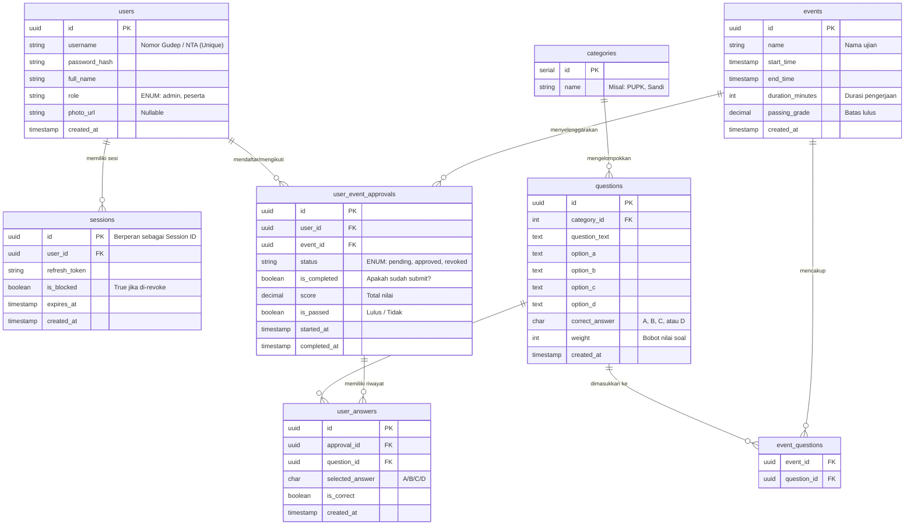

# Database Schema & ERD: Pramuka CAT

Dokumen ini merincikan desain tabel pada database PostgreSQL untuk sistem ujian, lengkap dengan _Entity-Relationship Diagram_ (ERD).

## 1. Entity-Relationship Diagram (ERD)
Diagram di bawah ini menggambarkan relasi antar entitas utama dalam sistem.

---

## 2. Rincian Tabel (Data Dictionary)

### a. Tabel `users`
Menyimpan data identitas Peserta dan Admin.
- Username dibuat unik (misalnya nomor NTA Pramuka) untuk mencegah duplikasi login.
- Terdapat kolom `role` untuk membedakan otoritas.

### b. Tabel `sessions`
Tabel pendukung untuk keamanan Autentikasi ganda (Stateful JWT).
- Menyimpan riwayat **Refresh Token** saat user *login*.
- Kolom `is_blocked` memungkinkan Admin menendang paksa (mencabut akses jarak jauh) user yang dicurigai melakukan kecurangan tanpa menunggu token kedaluwarsa.

### c. Tabel `categories`
Tabel referensi sederhana (Kamus Kategori) untuk memudahkan Admin memfilter bank soal berdasarkan materi tertentu.

### c. Tabel `questions`
Pusat dari Bank Soal.
- Setiap baris memiliki 4 opsi teks (`option_a` - `option_d`).
- Kolom `correct_answer` hanya menyimpan satu huruf (A/B/C/D) sebagai kunci jawaban mutlak.
- Kolom `weight` krusial untuk fitur **Sistem Bobot Soal**, defaultnya bisa diisi `1` atau sesuai instruksi Admin.

### d. Tabel `events`
Tabel ini bertindak sebagai "Ruang Ujian".
- Mengontrol kapan rentang ujian bisa diakses (`start_time` hingga `end_time`).
- `duration_minutes` digunakan *Frontend* untuk memunculkan *Countdown Timer*.
- `passing_grade` akan dicocokkan otomatis dengan nilai peserta di akhir sesi ujian.

### e. Tabel Pivot `event_questions`
Tabel relasi (Many-to-Many) antara `events` dan `questions`. Jika admin memilih soal secara spesifik untuk event tertentu (Distribusi Soal Manual), relasinya disimpan di sini.

### f. Tabel `user_event_approvals`
Jantung dari operasional peserta ujian. Berperan ganda sebagai tabel "Pendaftaran" sekaligus "Rapor Ujian".
- Ketika peserta mengklik "Ikut Event", baris dibuat dengan `status = pending`.
- Jika admin menyetujui, `status = approved`. Jika dibatalkan, `status = revoked`.
- Setelah peserta selesai ujian, `is_completed` diset _true_, lalu nilai dijumlahkan ke `score` dan `is_passed` dikalkulasi.

### g. Tabel `user_answers`
Tabel riwayat per jawaban. Sangat berguna untuk kebutuhan **Monitoring dan Review**.
- Admin bisa melihat jawaban apa yang dipilih peserta di setiap nomor dan apakah statusnya `is_correct` (benar).
- Data pada tabel ini merupakan data final yang di-_push_ dari Redis saat ujian selesai/terkumpul.
