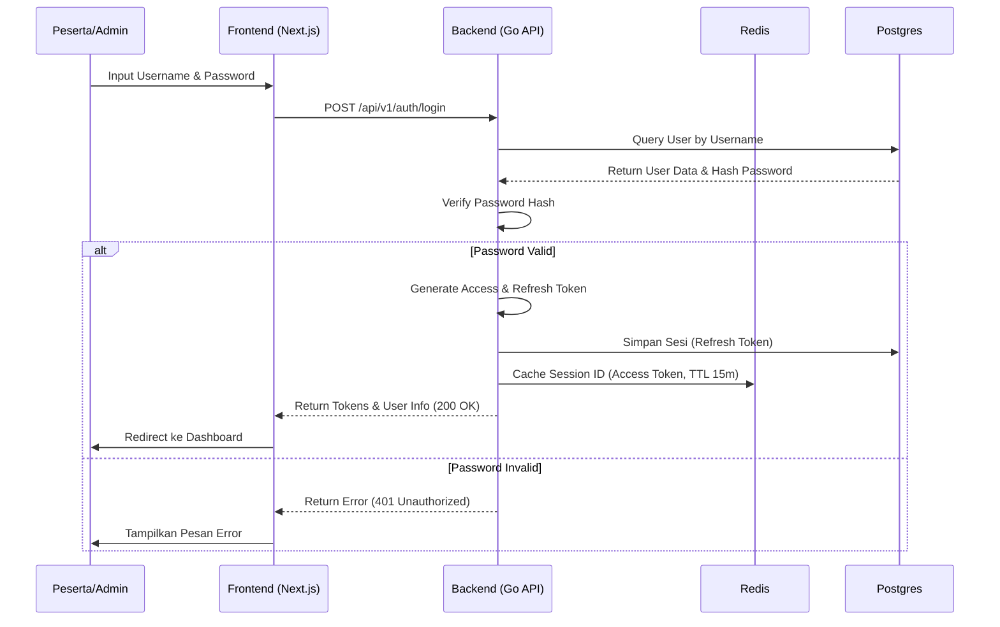
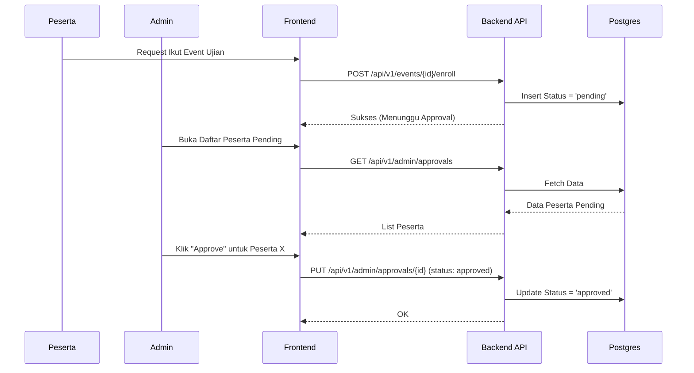
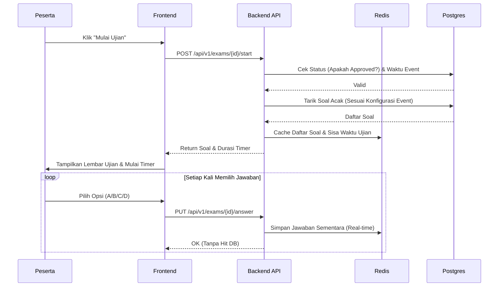
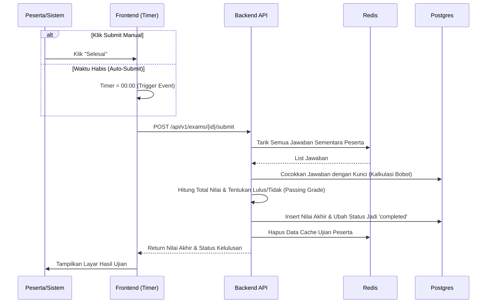

# Sequence Diagrams: Pramuka CAT

Dokumen ini berisi diagram urutan (_Sequence Diagram_) yang menjelaskan alur interaksi antara Pengguna, Frontend (Next.js), Backend API (Go Echo), Database Utama (PostgreSQL), dan Cache (Redis) untuk fitur-fitur krusial di aplikasi.

## 1. Alur Login & Autentikasi
Alur ini menjelaskan bagaimana peserta atau admin memvalidasi identitas mereka ke dalam sistem.

**Langkah-langkah (Narasi):**
1. Pengguna (Peserta/Admin) memasukkan _Username_ dan _Password_ di halaman Login Frontend.
2. Frontend mengirim *request* `POST /login` ke Backend.
3. Backend mencari data pengguna di database PostgreSQL berdasarkan _Username_.
4. Database mengembalikan data pengguna beserta *hash* dari password.
5. Backend melakukan verifikasi (mencocokkan *hash* password dengan *input* pengguna).
6. Jika **Valid**, Backend akan men-*generate* JWT (_JSON Web Token_) dan mengirimkannya ke Frontend. Frontend kemudian mengalihkan pengguna ke halaman *Dashboard*.
7. Jika **Tidak Valid**, Backend mengirim kode *error* 401 dan Frontend menampilkan pesan gagal.



---

## 1.5 Alur Refresh Token & Keamanan Sesi
Alur ini berjalan secara transparan di *background* untuk memastikan kenyamanan peserta tanpa mengorbankan keamanan.

**Langkah-langkah (Narasi):**
1. Setiap kali Frontend meminta data, *Access Token* dikirim ke Backend. Backend mengecek ketersediaan `Session ID` tersebut di **Redis**. Jika ada, _request_ dilayani sangat cepat.
2. Jika *Access Token* kedaluwarsa atau terhapus dari Redis, Frontend diam-diam memanggil `POST /auth/refresh` dengan membawa *Refresh Token*.
3. Backend memverifikasi *Refresh Token* ke PostgreSQL (tabel `sessions`). Sistem memastikan sesi belum kedaluwarsa dan tidak sedang `is_blocked = true` (belum dicabut aksesnya oleh admin).
4. Jika valid, Backend mencetak pasangan token baru, menyimpannya kembali ke DB dan Redis, lalu membalas ke Frontend agar pengguna tidak menyadari ada token yang baru diterbitkan.

```mermaid
sequenceDiagram
    participant F as Frontend
    participant B as Backend API
    participant R as Redis
    participant DB as Postgres

    F->>B: POST /api/v1/auth/refresh (Membawa Refresh Token)
    B->>DB: Verifikasi Refresh Token & Cek is_blocked
    DB-->>B: Sesi Valid
    B->>B: Generate New Access & Refresh Tokens
    B->>DB: Update Refresh Token Baru di PostgreSQL
    B->>R: Cache Session ID Baru di Redis (TTL 15m)
    B-->>F: Return Tokens Baru

---

## 2. Alur Manajemen Event & Setup Soal (Admin Flow)
Alur ini merinci bagaimana Admin menyiapkan Bank Soal dan merilis Jadwal Ujian (Event).

**Langkah-langkah (Narasi):**
1. Admin masuk ke halaman Manajemen Soal dan menginput data soal beserta opsi jawaban (A/B/C/D), kunci jawaban, dan bobot.
2. Frontend mengirim data soal ke Backend melalui `POST /questions`, lalu Backend menyimpannya di PostgreSQL.
3. Setelah bank soal dirasa cukup, Admin masuk ke halaman Manajemen Event untuk menerbitkan ujian baru.
4. Admin menginput nama Event, rentang waktu ujian, _Passing Grade_ (batas lulus), dan mengatur parameter pengambilan soal (misal: "Acak 100 soal dari kategori PUPK").
5. Frontend mengirim konfigurasi ini melalui `POST /events`.
6. Backend memvalidasi data dan menyimpannya di PostgreSQL sebagai Event ujian baru yang siap diikuti (di-_enroll_) oleh para anggota pramuka.

```mermaid
sequenceDiagram
    participant A as Admin
    participant F as Frontend
    participant B as Backend API
    participant DB as Postgres

    A->>F: Input Soal Baru (Soal, Opsi, Kunci, Bobot)
    F->>B: POST /api/v1/admin/questions
    B->>DB: Insert Question Data
    DB-->>B: OK
    B-->>F: Success (Soal Tersimpan)

    A->>F: Setup Event Baru (Waktu, Passing Grade, Rule Soal)
    F->>B: POST /api/v1/admin/events
    B->>DB: Insert Event & Distribusi Soal
    DB-->>B: OK
    B-->>F: Success (Event Diterbitkan)
```

---

## 3. Alur Persetujuan (Approval) Peserta
Peserta tidak bisa sembarangan mengikuti ujian meskipun sudah login. Mereka harus mendaftar/memilih *event*, lalu disetujui Admin.

**Langkah-langkah (Narasi):**
1. Peserta memilih *Event* yang tersedia di *Dashboard* dan menekan tombol "Ikut Ujian" (Enroll).
2. Backend menerima _request_ tersebut dan mencatat riwayat partisipasi peserta di database dengan status `pending`.
3. Admin masuk ke halaman *Approval* dan melihat tabel daftar peserta berstatus `pending`.
4. Admin menekan tombol "Approve" (Setuju) untuk mengizinkan peserta tersebut.
5. Frontend Admin mengirim instruksi ke Backend untuk memperbarui (_update_) status peserta menjadi `approved` di database PostgreSQL.



---

## 4. Alur Pelaksanaan Ujian (Real-time & Auto-Resume)
Ini adalah alur di mana Redis berperan sebagai penyimpan jawaban sementara untuk menahan *load* ke database utama.

**Langkah-langkah (Narasi):**
1. Peserta (yang statusnya sudah `approved`) menekan tombol "Mulai Ujian".
2. Backend memvalidasi status peserta dan apakah saat ini adalah waktu ujian yang legal berdasarkan database.
3. Backend menarik daftar soal secara acak (sesuai _rule_ Event) dari PostgreSQL.
4. Backend menyimpan paket soal ini berserta batas waktu (Timer) ke dalam *Cache* (Redis) khusus untuk sesi peserta tersebut.
5. Frontend mulai menampilkan soal satu per satu, dan *Timer Countdown* berjalan.
6. Setiap kali peserta memilih jawaban (A/B/C/D), Frontend mengirim respons di _background_ ke Backend.
7. Backend secara _real-time_ menyimpan jawaban tersebut ke Redis tanpa membebani (Hit) database PostgreSQL, memastikan aplikasi berkinerja tinggi dan jawaban aman jika internet terputus (_Auto-Resume_).



---

## 5. Alur Penilaian & Auto-Submit (Scoring Flow)
Terjadi ketika waktu di *browser* habis, atau peserta sengaja menekan tombol "Selesai".

**Langkah-langkah (Narasi):**
1. *Trigger* pengumpulan ujian bisa terjadi dua cara: Peserta klik "Selesai" secara manual, ATAU Frontend memicu paksa (*Auto-Submit*) karena Timer menunjukkan angka `00:00`.
2. Frontend menembak _endpoint_ `submit` ke Backend.
3. Backend mengambil seluruh opsi jawaban yang diisi peserta dari *Cache* (Redis).
4. Backend mencocokkan jawaban peserta dengan kunci jawaban yang benar di database, lalu mengakumulasi poin berdasarkan bobot soal.
5. Backend melakukan proses standardisasi skor akhir menjadi skala 100 dengan rumus Auto-Bobot `(Skor Peserta / Total Bobot Event) * 100`.
6. Backend membandingkan total nilai peserta dengan _Passing Grade_ yang diatur pada *Event* tersebut untuk meluluskan atau menggagalkan peserta.
7. Hasil akhir (Total Nilai dan Status Lulus/Tidak Lulus) disimpan secara permanen ke PostgreSQL.
8. Sesi *Cache* ujian peserta di Redis dibersihkan.
9. Frontend memunculkan layar "Hasil Ujian" yang menampilkan rekap nilai.


