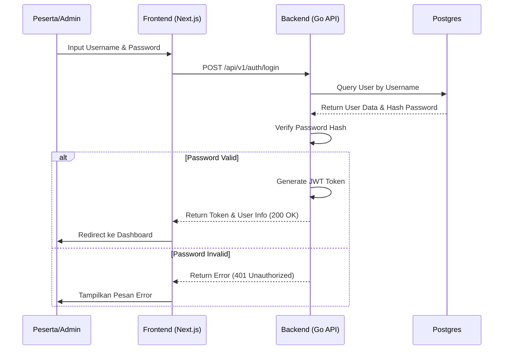
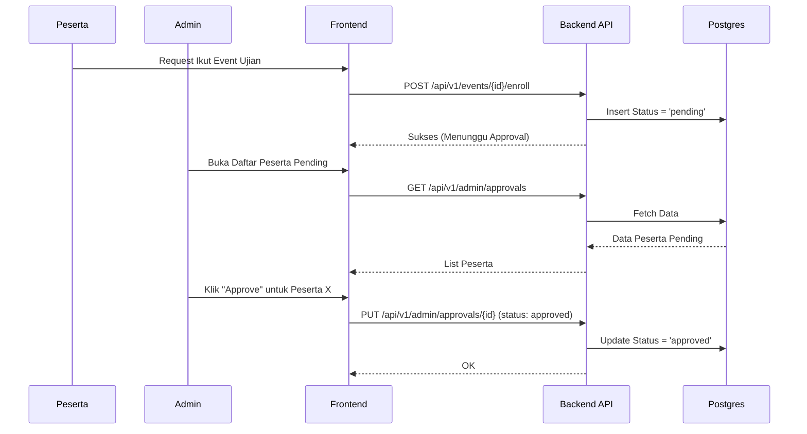
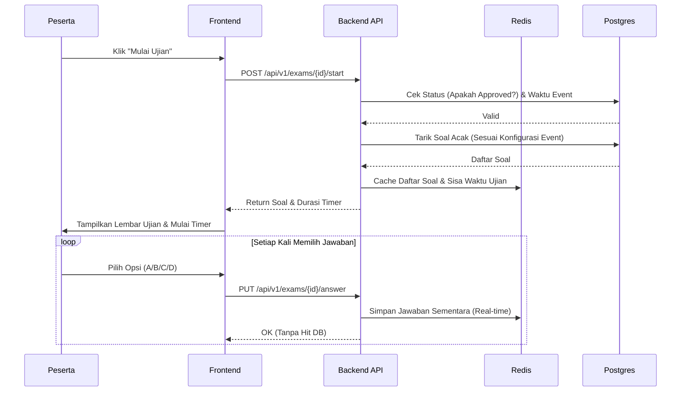
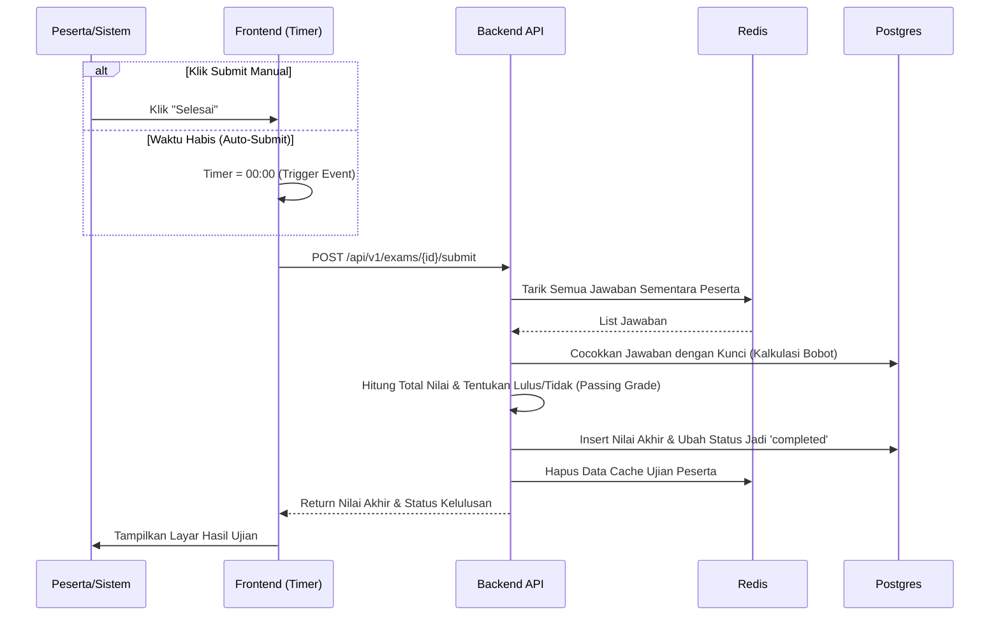

# Sequence Diagrams: Pramuka CAT

Dokumen ini berisi diagram urutan (_Sequence Diagram_) yang menjelaskan alur interaksi antara Pengguna, Frontend (Next.js), Backend API (Go Echo), Database Utama (PostgreSQL), dan Cache (Redis) untuk fitur-fitur krusial di aplikasi.

## 1. Alur Login & Autentikasi
Menjelaskan bagaimana peserta atau admin memvalidasi identitas mereka.

---

## 2. Alur Persetujuan (Approval) Peserta
Peserta tidak bisa sembarangan mengikuti ujian meskipun sudah login. Mereka harus mendaftar/memilih *event*, lalu disetujui Admin.

---

## 3. Alur Pelaksanaan Ujian (Real-time & Auto-Resume)
Ini adalah alur paling penting, di mana Redis berperan sebagai penyimpan jawaban sementara untuk menahan *load* ke database PostgreSQL.

---

## 4. Alur Penilaian & Auto-Submit (Scoring Flow)
Terjadi ketika waktu di *browser* habis, atau peserta sengaja menekan tombol "Selesai".

